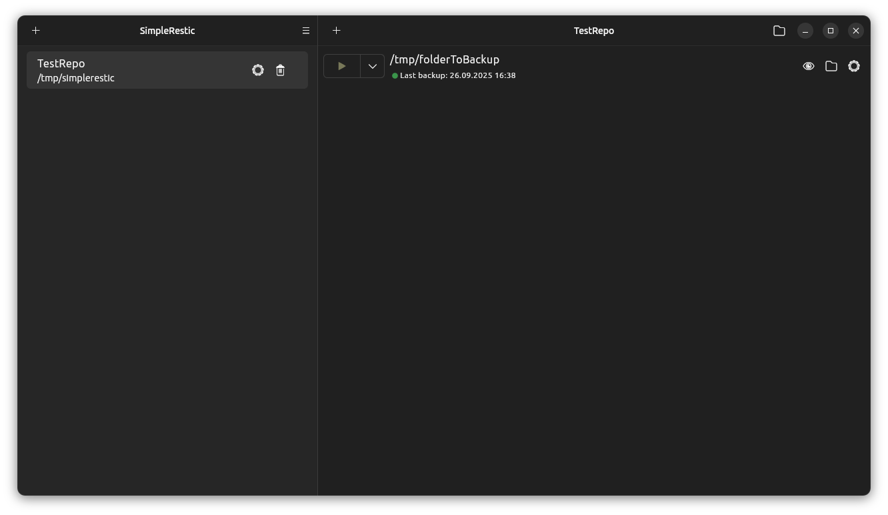
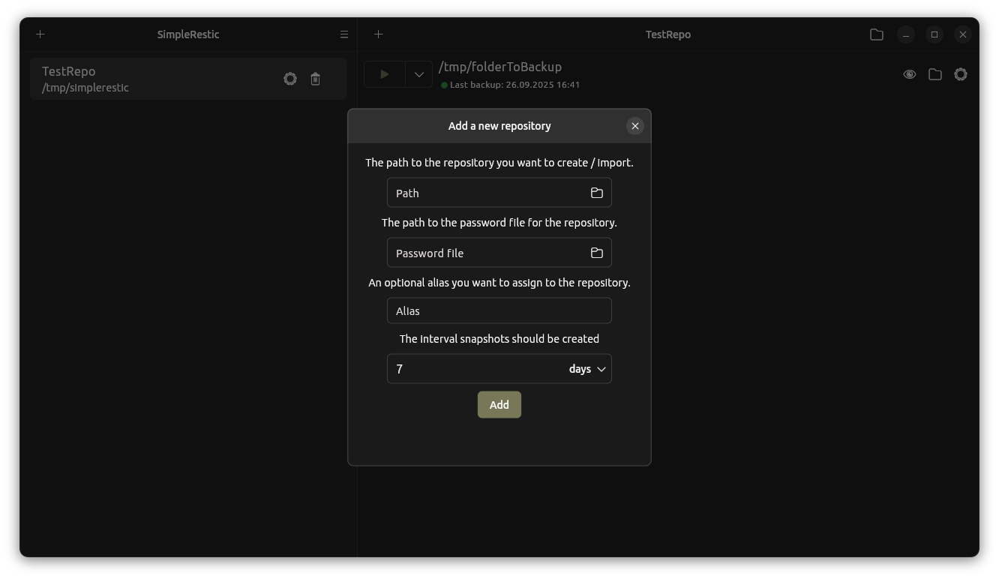
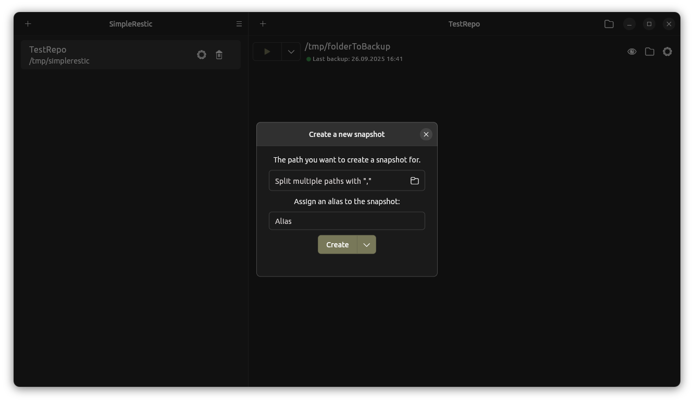
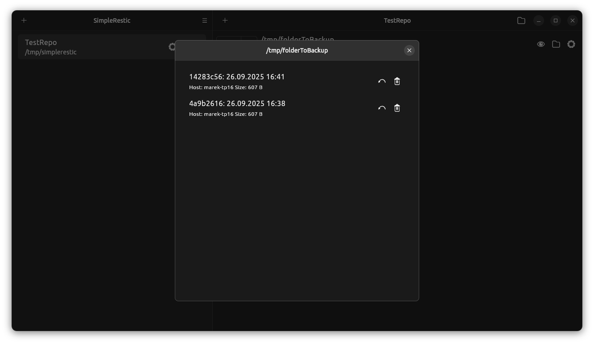
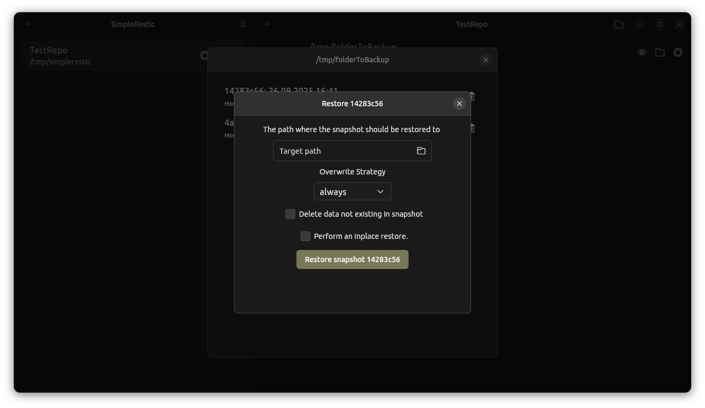

# simplerestic

**Simplerestic** is a graphical backup manager built on top of the amazing [restic](https://github.com/restic/restic) project.
It provides an Ubuntu Yaru–themed GUI to manage your restic backups without needing to use the command line.

Currently, simplerestic only works with Linux (tested with Ubuntu 24.04).

> [!CAUTION]
> This project is still in an early stage and may contain bugs. Use with caution for critical backups.

---

## ✨ Features

* Create and import restic repositories
* Create, forget, and restore snapshots
  * Supports **dry runs** for snapshot creation
* Mount repositories (optionally filtered by path)
* Backup interval indicator

---

## 🛠️ Planned Features

* [ ] Integrate the `check` command
* [ ] Integrate the `copy` command
* [ ] Compare snapshots
* [ ] Support environment variables instead of password files
* [ ] Include/exclude files and add tags during snapshot creation
* [ ] Download restic automatically instead of bundling the binary
* [ ] Add statistics including `stats` command information
* [ ] Add windows support

---

## 🚀 Installation & Usage

TBD

---

## 📷 Screenshots

---

## 📄 License

This project is licensed under the **GNU General Public License v3.0**.
See the [LICENSE](LICENSE) file for details.

**Note:**

* The included **restic executable** is licensed under the **BSD 2-Clause License**.
* A copy of this license can be found [here](assets/LICENSE_restic).
