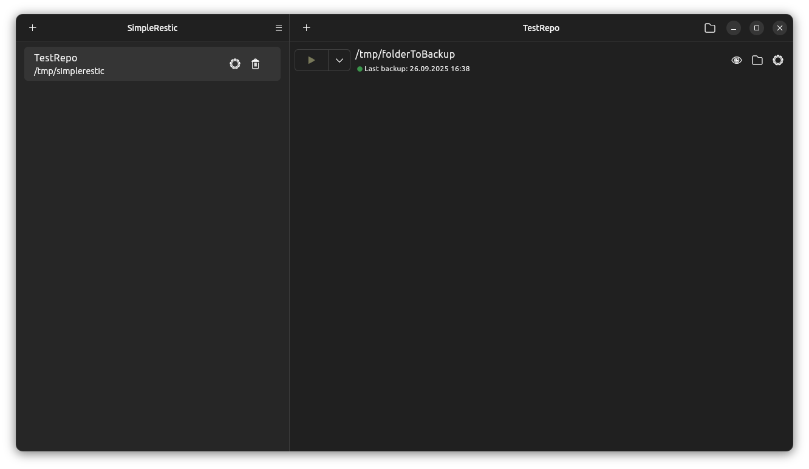
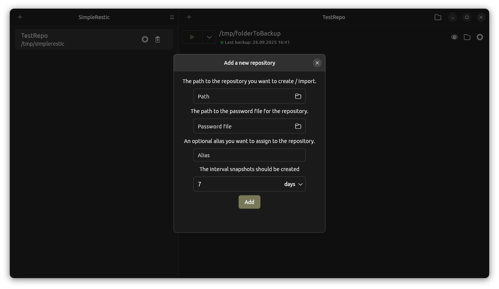
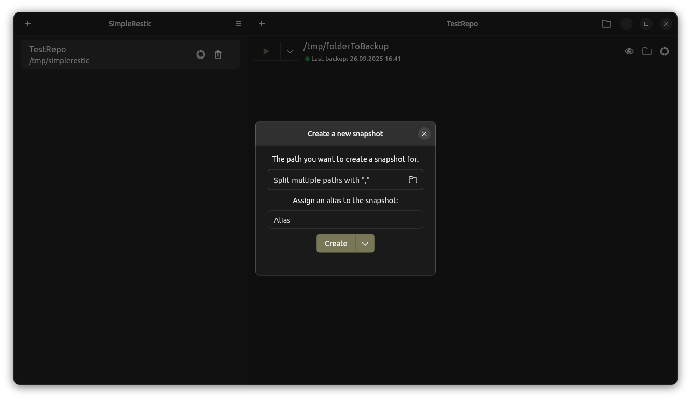
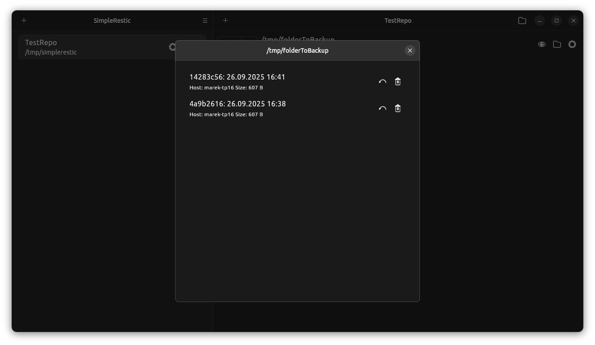
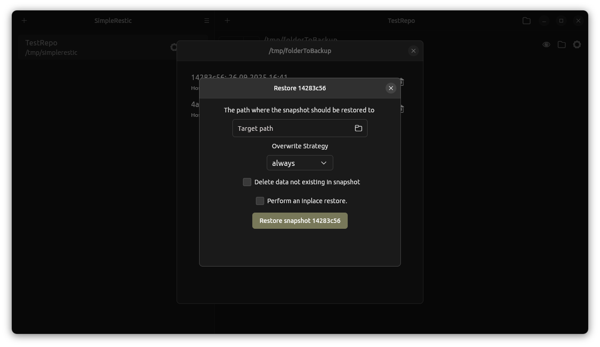

# simplerestic



**Simplerestic** is a graphical backup manager built on top of the amazing [restic](https://github.com/restic/restic) project.
It provides an Ubuntu Yaru–themed GUI to manage your restic backups without needing to use the command line.

Currently, simplerestic works with Linux (tested with Ubuntu 24.04) and Windows.

> [!CAUTION]
> This project is still in an early stage and may contain bugs. Use with caution for critical backups.

---

## ✨ Features

* Create, import and check restic repositories
* Create, forget, and restore snapshots
  * Supports **dry runs** for snapshot creation
* Mount repositories (optionally filtered by path)
* Backup interval indicator

---

## 🛠️ Planned Features

* [ ] Integrate the `copy` command
* [ ] Compare snapshots
* [ ] Support environment variables instead of password files
* [ ] Include/exclude files and add tags during snapshot creation
* [ ] Download restic automatically instead of bundling the binary
* [ ] Add statistics including `stats` command information

---

## 🚀 Installation & Usage

Currently, there is no prebuilt executable available.

To build simplerestic yourself, you need to have [Flutter](https://docs.flutter.dev/install) installed.
- It is recommended to just use [fvm](https://fvm.app/)
  - fvm will automatically install and use the correct flutter version to ensure compatibility.
- Alternatively, you can also install the [currently used version](.fvmrc) globally on your machine

The command to build the application:
```bash
# For Linux
fvm flutter build linux
# For Windows
fvm flutter build windows
```
(Without fvm):
```bash
# For Linux
flutter build linux
# For Windows
flutter build windows
```

After running the build command you should find the executable under:
  - Linux: `build/linux/x64/release/bundle`
  - Windows: `build\windows\x64\runner\Release\`

---

## 📷 Screenshots






---

## 📄 License

This project is licensed under the **GNU General Public License v3.0**.
See the [LICENSE](LICENSE) file for details.

**Note:**

* The included **restic executable** is licensed under the **BSD 2-Clause License**.
* A copy of this license can be found [here](assets/LICENSE_restic).
